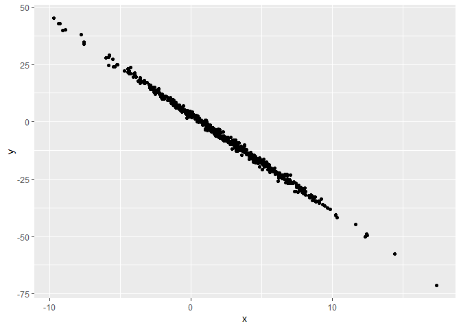

Simple document
================
Alex Perry
July 2021

I’m an R Markdown document!

# Section 1

Here’s a **code chunk** that samples from a *normal distribution*:

``` r
samp = rnorm(100)
length(samp)
```

    ## [1] 100

# Section 2

I can take the mean of the sample, too! The mean is 0.2040923.

The code chunk below creates a datafraem and generates a plot.

## Data frame and plot

``` r
library(tidyverse)

plot_df = tibble(
  x = rnorm(500, mean = 2, sd = 4),
  y = 3 - 4.2 * x + rnorm(500)
  
)

ggplot(plot_df, aes(x = x, y = y)) + geom_point()
```

<!-- -->

This plot is really great!! It shows a linear relationship just as
expected.

The data frame has 500 rows.

# Section 3

Here is a list:

-   This is my first list item
-   Lists need at least two items
    -   this list has a sub item
-   Third list item

| Col 1 | Col 2 |
|-------|-------|
| a     | b     |
| c     | c     |
| d     | e     |

> This is a block quote
